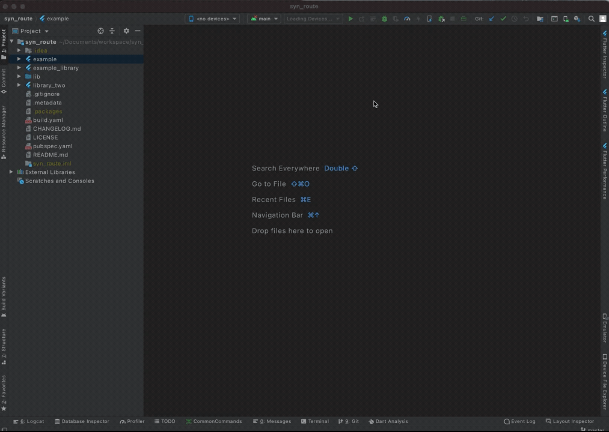
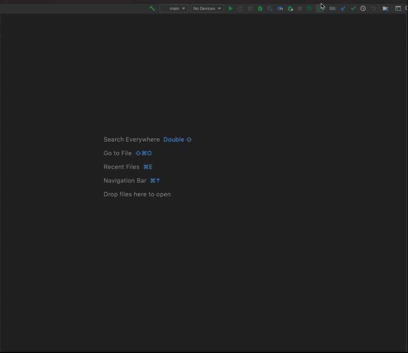
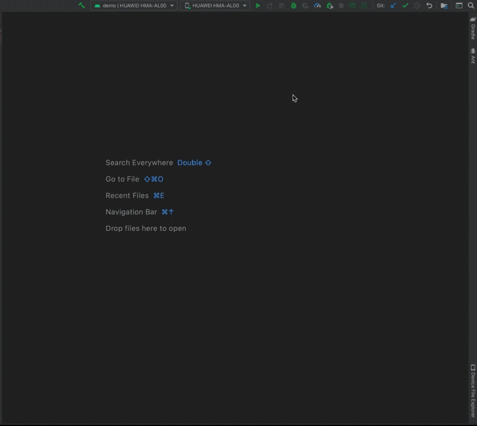
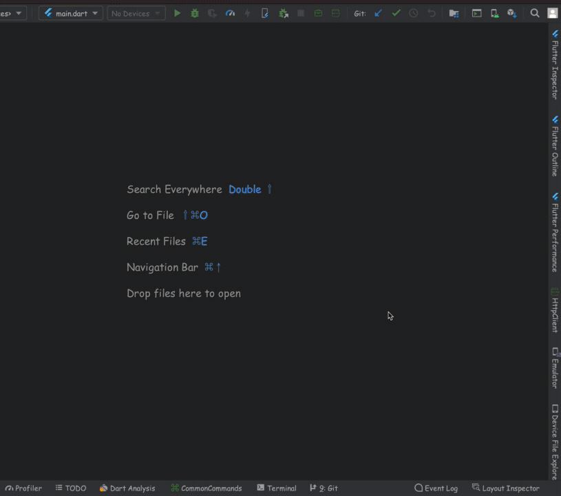
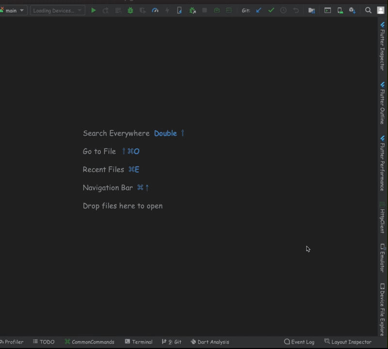

# CommonTools
An IntelliJ plugin with Some Useful Commands for Flutter、Git、ADB，and Dart、Java code generator, it's good for Android and Flutter developer.
============
## Documentation

- [Installation](#Installation)
- [TemplateProvider](#TemplateProvider)
- [Commands](#Commands)
- [GitTools](#GitTools)
- [HttpClient](#HttpClient)
- [GenerateRequest](#GenerateRequest)

## Installation
- in Android Studio or others Intellij Idea: go to `Preferences → Plugins → Browse repositories` and search for `CommonTools`
_or_
- [download it](https://plugins.jetbrains.com/plugin/16449) and install via `Preferences → Plugins → Install plugin from disk`

## TemplateProvider
- Generates StatelessWidget、StatefulWidget with flutter/material or flutter/cupertino
  In a dart file, type word `stlm` or `stlc` or `stfm` or `stfc`, it will generate a StatelessWidget/StatefulWidget class


## Commands
- Flutter command support:
```
    flutter clean
    flutter pub get
    flutter pub run build_runner build --delete-conflicting-outputs
```


## GitTools
- Support git pull --rebase、git tag、git push tag commands.


## HttpClient
- Support GET、POST、PUT、DELETE method, and convert json to java/dart class which from httpClient or user's input.





## GenerateRequest
- Generate java/dart code for http request which from httpClient.




